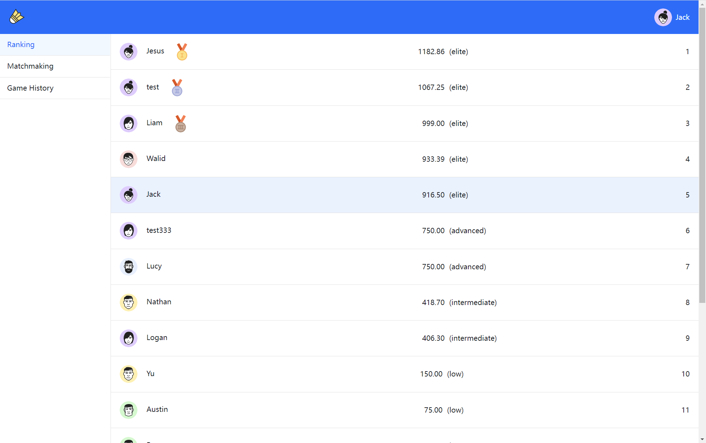

# Team Sigma
## app: sigma-badminton
## Fall 2022 

## Overview:
我们的应用是一个在1v1情况下让羽毛球运动员互相比赛的平台，它有一个竞争性比赛的排名系统，每个羽毛球运动员可以在系统中随机匹配与自己水平相当的对手进行比赛。在线下比赛结束之后，双方可以输入比赛分数的结果，如果输入的分数不匹配则给出对应的提示信息，如果从每个用户输入的结果匹配，则会保存结果，因为已达成协议。随后根据比赛结果对双方进行加减分 针对分数重新给user定level(这里需要用到ELO算法)。

以下是原需求，根据情况加减描述： 
Innovative Idea: 1v1 Badminton Ranked Matchmaking
A platform that matches Badminton players against each other in 1v1 instances. This idea exists but what makes our idea cool is that it has a ranking system for competitive matches. At the end of a game, the users both input the results of the match. We would have in place an algorithm that then modifies the respective skill levels of each user that is reflective of the agreed upon match results. In application, the “skill” level attribute for each player can be used as a filtering for other people who want more skilled or less skilled players to play against. Would need to be based on the honor system. All we can do is identify if at least one person is lying but we still don’t know how to disincentivize lying or incentivize telling the truth. Apart from that, if the results inputed from each user match then results are saved because an agreement has been made.

Important Components:
We will have an algorithm that considers these features that determine rank level.
The algorithm is run at the end of a game event and it takes as input:
-Score: (tuple of two integers)
-player 1 rank (double)
-player 2 rank (double)

->returns an object with key values being the usernames of those involved in the game event and their respective rank score additions as values.

The losing side will receive a negative score addition if the mode is competitive. This way we take into account the difference of score when determining points to add to the respective players current rank. We have a database of all our users and their respective ranks. We sort them in descending order from highest rank. When it comes to determining if someone is lying on their scores, these are the ideas we have to implement:

1. If there is a difference between both score inputs, then we know at least one person has input wrong score information.
2. If there is a slight difference (we can go in depth about what slight means later) we can take the average of the two scores that will be outputted when adding to ranks.
3. We ask users if they are sure before inputting the score if the score they put is different than the other user’s score input. This way we add a second layer to the decision to decrease the chances of an incorrect score potentially.
4. Users potentially face being labeled as “Bad Sports” with repeated incorrect score uploads if playing a competitive game.
5. We rely on the honor system.

Users and their information are stored on a database. Any email accounts are accepted and will need to be activated via confirmation email.


## Team Members:
Huayang Yu: https://github.com/yhyyhy722
Walid Hamade: https://github.com/7medeh
Zhengrui Yang: https://github.com/msodz

# Screenshots
## SingIn Page
[](SignIn)
## SignUp Page
[](SignUp)
## Ranking Page
[](Ranking)
## Matchmaking Start Page
[](Matchmaking Start)
## Matchmaking Doing Page
[](Matchmaking Start)
## Matchmaking Input Page
[](Matchmaking Input)
## Matchmaking Input Error Page
[](Matchmaking Input Error)
## Game History Page
[](Game History)

## API

### SignUp
user sign up and create a new account
##### request
```javascript
POST /signup
```
##### body
| field    |  type  |    description |
|----------|:------:|---------------:|
| email    | string |     user email |
| name     | string | user full name |
| password | string |  user password |
```json
{
  "email": "jack@gmail.com",
  "name": "jack",
  "password": "123456"
}
```
##### response
###### 200
| field    |  type  |          description |
|----------|:------:|---------------------:|
| id       | string |       user unique id |
| email    | string |           user email |
| name     | string |       user full name |
| avatar   | string |          user avatar |
| level    | string | user badminton level |
| score    | number |   user ranking score |
| createAt |  Date  | user create datetime |
```json
{
  "id": "5bf142459b72e12b2b1b2cd",
  "email": "jack@gmail.com",
  "name": "jack",
  "password": "123456",
  "avatar": "https://www.uifaces.co/wp-content/themes/uifaces-theme/src/img/home-animation/avatar-1.svg",
  "level": "elite",
  "score": 999,
  "createAt": "2022-11-20 11:40:43.231"
}
```

### SignIn
user sign in to access system
##### request
```javascript
POST /signin
```
##### body
| field    |  type  |    description |
|----------|:------:|---------------:|
| email    | string |     user email |
| password | string |  user password |
```json
{
  "email": "jack@gmail.com",
  "password": "123456"
}
```
##### response
###### 200
| field    |  type  |          description |
|----------|:------:|---------------------:|
| id       | string |       user unique id |
| email    | string |           user email |
| name     | string |       user full name |
| password | string |        user password |
| avatar   | string |          user avatar |
| level    | string | user badminton level |
| score    | number |   user ranking score |
| createAt |  Date  | user create datetime |
```json
{
  "id": "5bf142459b72e12b2b1b2cd",
  "email": "jack@gmail.com",
  "name": "jack",
  "password": "123456",
  "avatar": "https://www.uifaces.co/wp-content/themes/uifaces-theme/src/img/home-animation/avatar-1.svg",
  "level": "elite",
  "score": 999,
  "createAt": "2022-11-20 11:40:43.231"
}
```

### Update User level
Update the users' scores after the user set their initial level at home page
##### request
```javascript
PUT /:email
```
##### parameters
| field |  type  | description |
|-------|:------:|------------:|
| email | string |  user email |
##### body
| field    |  type  |           description |
|----------|:------:|----------------------:|
| level    | string | badminton skill level |
```json
{
  "level": "intermediate"
}
```
##### response
###### 200
| field    |  type  |          description |
|----------|:------:|---------------------:|
| id       | string |       user unique id |
| email    | string |           user email |
| name     | string |       user full name |
| password | string |        user password |
| avatar   | string |          user avatar |
| level    | string | user badminton level |
| score    | number |   user ranking score |
| createAt |  Date  | user create datetime |
```json
{
  "id": "5bf142459b72e12b2b1b2cd",
  "email": "jack@gmail.com",
  "name": "jack",
  "password": "123456",
  "avatar": "https://www.uifaces.co/wp-content/themes/uifaces-theme/src/img/home-animation/avatar-1.svg",
  "level": "elite",
  "score": 999,
  "createAt": "2022-11-20 11:40:43.231"
}
```

### Get User
Get user information by userId
##### request
```javascript
GET /user/:id
```
##### parameters
| field |  type  | description |
|-------|:------:|------------:|
| id    | string |     user id |
##### response
###### 200
| field    |  type  |          description |
|----------|:------:|---------------------:|
| id       | string |       user unique id |
| email    | string |           user email |
| name     | string |       user full name |
| password | string |        user password |
| avatar   | string |          user avatar |
| level    | string | user badminton level |
| score    | number |   user ranking score |
| createAt |  Date  | user create datetime |
```json
{
  "id": "5bf142459b72e12b2b1b2cd",
  "email": "jack@gmail.com",
  "name": "jack",
  "password": "123456",
  "avatar": "https://www.uifaces.co/wp-content/themes/uifaces-theme/src/img/home-animation/avatar-1.svg",
  "level": "elite",
  "score": 999,
  "createAt": "2022-11-20 11:40:43.231"
}
```

### Start matching
Start matching the opponents. The system will match the opponents with the same level of users
##### request
```javascript
POST /matching
```
##### body
| field |  type  | description |
|-------|:------:|------------:|
| email | string |  user email |
```json
{
  "email": "jack@gmail.com"
}
```
##### response
###### 200
| field         |  type  |                                  description |
|---------------|:------:|---------------------------------------------:|
| id            | string |                       game history unique id |
| user          |  User  |                        home user of the game |
| opponent      |  User  |                    opponent user of the game |
| address       | string |                          address of the game |
| userScore     | number |                              home user score |
| opponentScore | number |                          opponent user score |
| status        | string | status of the game(preparing/inputting/over) |
| gameTime      |  Date  |                       start time of the game |
| createAt      |  Date  |                      create time of the game |
```json
{
  "_id": "637a1ec30cffefbfdc2cb6a6",
  "user": {
    "_id": "637a123b3d43c85cda58cd12",
    "email": "test@gmail.com",
    "name": "test",
    "password": "123456",
    "avatar": "https://www.uifaces.co/wp-content/themes/uifaces-theme/src/img/home-animation/avatar-5.svg",
    "level": "advanced",
    "score": 750,
    "createAt": "2022-11-20T11:40:43.231Z"
  },
  "opponent": {
    "_id": "637a12b23d43c85cda58cd13",
    "email": "Jack@gmail.com",
    "name": "Jack",
    "password": "123456",
    "avatar": "https://www.uifaces.co/wp-content/themes/uifaces-theme/src/img/home-animation/avatar-5.svg",
    "level": "advanced",
    "score": 601,
    "createAt": "2022-11-20T11:42:42.420Z"
  },
  "address": "The First Badminton Court",
  "userScore": 12,
  "opponentScore": 12,
  "status": "over",
  "gameTime": "2022-11-21T12:34:11.773Z",
  "createAt": "2022-11-20T12:34:11.773Z"
}
```

### Update matching
Update the result(score/status) of the game and user(score)
##### request
```javascript
POST /updateScore
```
##### body
| field         |  type  |         description |
|---------------|:------:|--------------------:|
| gameId        | string |      ID of the game |
| email         | string |     home user email |
| myScore       | number |     home user score |
| opponentScore | number | opponent user score |
| userId        | string | ID of the home user |
```json
{
  "gameId": "637a1ec30cffefbfdc2cb6a6",
  "email": "Jack@gmail.com",
  "myScore": 12,
  "opponentScore": 13,
  "userId": "637a123b3d43c85cda58cd12"
}
```
##### response
###### 200
| field         |  type  |                                  description |
|---------------|:------:|---------------------------------------------:|
| id            | string |                       game history unique id |
| user          |  User  |                        home user of the game |
| opponent      |  User  |                    opponent user of the game |
| address       | string |                          address of the game |
| userScore     | number |                              home user score |
| opponentScore | number |                          opponent user score |
| status        | string | status of the game(preparing/inputting/over) |
| gameTime      |  Date  |                       start time of the game |
| createAt      |  Date  |                      create time of the game |
```json
{
  "_id": "637a1ec30cffefbfdc2cb6a6",
  "user": {
    "_id": "637a123b3d43c85cda58cd12",
    "email": "test@gmail.com",
    "name": "test",
    "password": "123456",
    "avatar": "https://www.uifaces.co/wp-content/themes/uifaces-theme/src/img/home-animation/avatar-5.svg",
    "level": "advanced",
    "score": 750,
    "createAt": "2022-11-20T11:40:43.231Z"
  },
  "opponent": {
    "_id": "637a12b23d43c85cda58cd13",
    "email": "Jack@gmail.com",
    "name": "Jack",
    "password": "123456",
    "avatar": "https://www.uifaces.co/wp-content/themes/uifaces-theme/src/img/home-animation/avatar-5.svg",
    "level": "advanced",
    "score": 601,
    "createAt": "2022-11-20T11:42:42.420Z"
  },
  "address": "The First Badminton Court",
  "userScore": 12,
  "opponentScore": 12,
  "status": "over",
  "gameTime": "2022-11-21T12:34:11.773Z",
  "createAt": "2022-11-20T12:34:11.773Z"
}
```

### Get ranking list
Get the ranking of all users in the system by their scores
##### request
```javascript
GET /raking
```
##### response
###### 200
| field    |  type   |          description |
|----------|:-------:|---------------------:|
| id       | string  |    ranking unique id |
| email    | string  |           user email |
| name     | string  |       user full name |
| avatar   | string  |          user avatar |
| level    | string  | user badminton level |
| score    | number  |   user ranking score |
| createAt |  Date   | user create datetime |
```json
[
    {
      "id": "5bf142459b72e12b2b1b2cd",
      "email": "jack@gmail.com",
      "name": "jack",
      "avatar": "https://www.uifaces.co/wp-content/themes/uifaces-theme/src/img/home-animation/avatar-1.svg",
      "level": "elite",
      "score": 999,
      "createAt": "2022-11-20 11:40:43.231"
    },
    {
      "id": "5bf142459b72e12b2b1b2cd",
      "email": "jack@gmail.com",
      "name": "jack",
      "avatar": "https://www.uifaces.co/wp-content/themes/uifaces-theme/src/img/home-animation/avatar-1.svg",
      "level": "elite",
      "score": 999,
      "createAt": "2022-11-20 11:40:43.231"
    }
]
```

### Get game history list
Get the user's game history
##### request
```javascript
GET /gameHistory
```
##### response
###### 200
| field         |  type  |                                  description |
|---------------|:------:|---------------------------------------------:|
| id            | string |                       game history unique id |
| user          |  User  |                        home user of the game |
| opponent      |  User  |                    opponent user of the game |
| address       | string |                          address of the game |
| userScore     | number |                              home user score |
| opponentScore | number |                          opponent user score |
| status        | string | status of the game(preparing/inputting/over) |
| gameTime      |  Date  |                       start time of the game |
| createAt      |  Date  |                      create time of the game |
```json
[
  {
    "_id": "637a1ec30cffefbfdc2cb6a6",
    "user": {
      "_id": "637a123b3d43c85cda58cd12",
      "email": "test@gmail.com",
      "name": "test",
      "password": "123456",
      "avatar": "https://www.uifaces.co/wp-content/themes/uifaces-theme/src/img/home-animation/avatar-5.svg",
      "level": "advanced",
      "score": 750,
      "createAt": "2022-11-20T11:40:43.231Z"
    },
    "opponent": {
      "_id": "637a12b23d43c85cda58cd13",
      "email": "Jack@gmail.com",
      "name": "Jack",
      "password": "123456",
      "avatar": "https://www.uifaces.co/wp-content/themes/uifaces-theme/src/img/home-animation/avatar-5.svg",
      "level": "advanced",
      "score": 601,
      "createAt": "2022-11-20T11:42:42.420Z"
    },
    "address": "The First Badminton Court",
    "userScore": 12,
    "opponentScore": 12,
    "status": "over",
    "gameTime": "2022-11-21T12:34:11.773Z",
    "createAt": "2022-11-20T12:34:11.773Z"
  },
  {
    "_id": "637ad6bf0d4d1a930441e723",
    "user": {
      "_id": "637a123b3d43c85cda58cd12",
      "email": "test@gmail.com",
      "name": "test",
      "password": "123456",
      "avatar": "https://www.uifaces.co/wp-content/themes/uifaces-theme/src/img/home-animation/avatar-5.svg",
      "level": "advanced",
      "score": 750,
      "createAt": "2022-11-20T11:40:43.231Z"
    },
    "opponent": {
      "_id": "637a12b23d43c85cda58cd13",
      "email": "Jack@gmail.com",
      "name": "Jack",
      "password": "123456",
      "avatar": "https://www.uifaces.co/wp-content/themes/uifaces-theme/src/img/home-animation/avatar-5.svg",
      "level": "advanced",
      "score": 661,
      "createAt": "2022-11-20T11:42:42.420Z"
    },
    "address": "30 Eastman Ln",
    "userScore": 3,
    "opponentScore": 11,
    "status": "over",
    "gameTime": "2022-11-22T01:39:11.551Z",
    "createAt": "2022-11-21T01:39:11.551Z",
    "firstInputId": "637a123b3d43c85cda58cd12"
  }
]
```

## Database Documentation
Our database is a collection containing two types of documents: Users and Games. They are described below
```javascript
    user document {  
        _id: <ObjectId>,            //ObjectId provided by MongoDB  
        email: String,              //Email of the user  
        name: String,               //Name of the user
        password: String,           //Password of the user  
        avatar: String,             //Avatar url link of the user  
        level: String,              //Badminton skill level of the user (["low", "intermediate", "advanced", "elite"]) 
        score: Number,              //The user's game scores that will increase or decrease after each game over
        createAt: Date,             //Time of user sign up
    } 
```  

```javascript
    game document {  
        _id: <ObjectId>,           //ObjectId provided by MongoDB  
        user: <User>,              //Home player in the game 
        opponent: <User>,          //Away player in the game
        address: String,           //Address of the game  
        userScore: Number,         //Home players' scores after the game over
        opponentScore: Number,     //Away players' scores after the game over
        status: String,            //Status of the current game (["preparing", "inputting", "over"])
        gameTime: Date,            //Start time of the game  
        createAt: Date,            //Create time of the game
		firstInputId: String,      //ID of the first input user
    } 
```

## URL routes:
https://sigma-badminton.herokuapp.com/    the index page of app, you can sign in here if you already have an account.

https://sigma-badminton.herokuapp.com/SignUp.html    if you are a new user, you can use this page to register.

https://sigma-badminton.herokuapp.com/Home.html      Only the users who first time sign in get access to this page. Users need to set their initial level at this page. When they sign in next time, this page will be skipped.

###All users who sign in successfully get access to the following pages:

https://sigma-badminton.herokuapp.com/Ranking.html    Rankings of all users. Users can check others' level and score at this page. The rankings and scores will be updated after every match finish.

https://sigma-badminton.herokuapp.com/Matchmaking.html   start a match with a same-level opponent. After the game over, player needs to upload game result. The system only accepts consistent results.

https://sigma-badminton.herokuapp.com/GameHistory.html   Your game results are saved here. Users can search a game by DateTime, Address, and Adversary.


## Authentication/Authorization:
Users' accounts and password are stored in the database after they sign up. 
If they enter the corresponding email and password, they will sign in successfully. There's no restriction to the existing users. Every users have access to all the webpages and functionality as long as they sign in successfully.


## Division of Labor
### Huayang Yu:

### Walid Hamade:

### Zhengrui Yang:

## Conclusion
