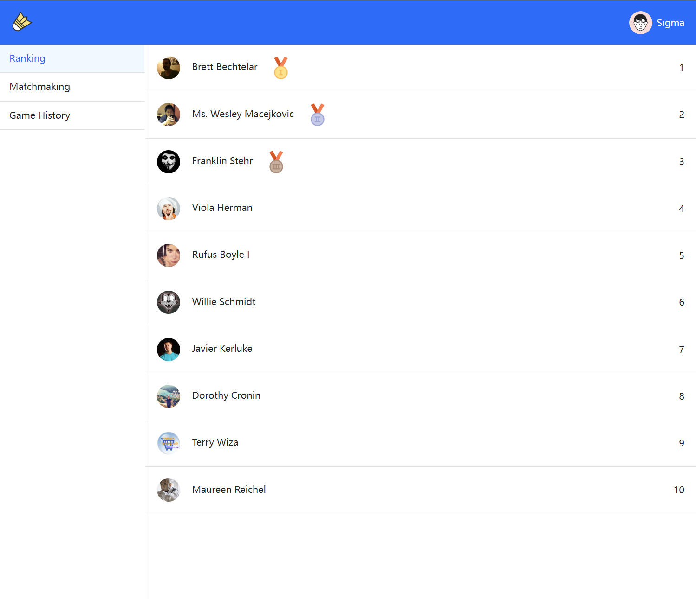

#API

### SignUp
user sign up to create a new user
##### request
```javascript
POST /signup
```
##### body
| field    |  type  |    description |
|----------|:------:|---------------:|
| email    | string |     user email |
| name     | string | user full name |
| password | string |  user password |
```json
{
  "email": "jack@gmail.com",
  "name": "jack",
  "password": "123456"
}
```
##### response
###### 200
| field    |  type  |    description |
|----------|:------:|---------------:|
| id       | string | user unique id |
| email    | string |     user email |
| name     | string | user full name |
| password | string |  user password |
```json
{
  "id": "5bf142459b72e12b2b1b2cd",
  "email": "jack@gmail.com",
  "name": "jack",
  "password": "123456"
}
```

### SignIn
user sign in to access system
##### request
```javascript
POST /signin
```
##### body
| field    |  type  |    description |
|----------|:------:|---------------:|
| email    | string |     user email |
| password | string |  user password |
```json
{
  "email": "jack@gmail.com",
  "password": "123456"
}
```
##### response
###### 200
| field    |  type  |    description |
|----------|:------:|---------------:|
| id       | string | user unique id |
| email    | string |     user email |
| name     | string | user full name |
| password | string |  user password |
```json
{
  "id": "5bf142459b72e12b2b1b2cd",
  "email": "jack@gmail.com",
  "name": "jack",
  "password": "123456"
}
```

### Update User level
Update the user after the user selects the badminton level on the home page
##### request
```javascript
PUT /:email
```
##### parameters
| field |  type  | description |
|-------|:------:|------------:|
| email | string |  user email |
##### body
| field    |  type  |           description |
|----------|:------:|----------------------:|
| level    | string | badminton skill level |
```json
{
  "level": "intermediate"
}
```
##### response
###### 200
| field    |  type  |           description |
|----------|:------:|----------------------:|
| id       | string |        user unique id |
| email    | string |            user email |
| name     | string |        user full name |
| password | string |         user password |
| level    | string | badminton skill level |
```json
{
  "id": "5bf142459b72e12b2b1b2cd",
  "email": "jack@gmail.com",
  "name": "jack",
  "password": "123456",
  "level": "intermediate"
}
```

### Get ranking list
Get the ranking information of badminton skills of all users in the system
##### request
```javascript
GET /raking
```
##### response
###### 200
| field  |  type  |           description |
|--------|:------:|----------------------:|
| id     | string |     ranking unique id |
| avatar | string | user avatar image url |
| name   | string |        user full name |
| rank   |  int   |      user credit rank |
```json
{
  "id": "5bf142459b72e12b2b1b2cd",
  "avatar": "http://fackerimage.png",
  "name": "jack",
  "rank": 1
}
```

### Get game history list
Get the user's game history
##### request
```javascript
GET /gameHistory
```
##### response
###### 200
| field     |  type   |                                    description |
|-----------|:-------:|-----------------------------------------------:|
| id        | string  |                         game history unique id |
| dateTime  | string  |                                      game time |
| address   | string  |                                     game venue |
| adversary | string  |                              name of adversary |
| score     | string  |                              game result score |
| isFinish  | boolean | whether the competition score has been entered |
```json
{
  "id": "5bf142459b72e12b2b1b2cd",
  "dateTime": "2022-11-02 11:00:00",
  "address": "Basketball Court",
  "adversary": "jack",
  "score": "11:9",
  "isFinish": false
}
```

# Screenshots
[](SignUp)
[](SignUp)
[](SignIn)
[](SignIn)
[](Ranking)
[](GameHistory)

# Heroku
[Heroku URL](https://badminton-sigma.herokuapp.com)
